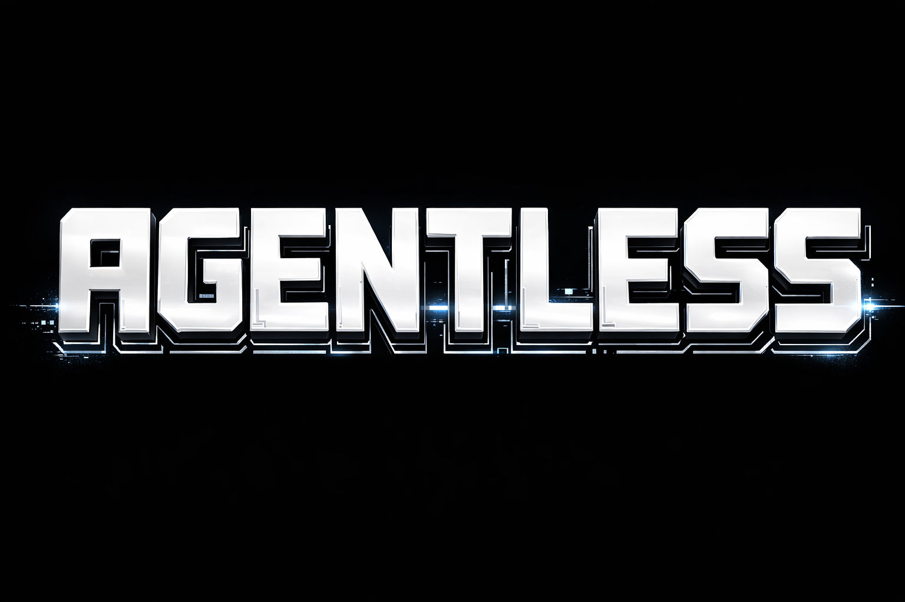

<div align="center">



**에이전트가 뭔지 몰라도 됩니다.**

필요한 전문가 모드를 자동으로 찾아서 추천해주는 Claude Code 플러그인.
만들고 있는 것에만 집중하세요.

[English](./README.md) · [시작하기](#시작하기) · [작동 원리](#작동-원리)

</div>

---

## 문제

[agency-agents](https://github.com/msitarzewski/agency-agents)에는 **60개 이상의 AI 전문가 페르소나**가 있습니다 — 프론트엔드, 백엔드, DevOps, 테스팅, 디자인, 마케팅 등. 하지만 한 가지 문제가 있죠 — **존재를 알아야 쓸 수 있다**는 것.

대부분의 사용자는 적합한 페르소나를 찾지 못합니다. 아무도 알려주지 않았으니까요.

## 해결

**agentless**는 이 장벽을 완전히 없앱니다.

- **프로젝트 스캔** — `/agents`로 기술 스택을 분석하고, 맞는 전문가 모드를 자동 추천합니다.
- **키워드 검색** — `/agents react`나 `/agents marketing`으로 60개 이상의 모드를 검색합니다.
- **자동 추천** — Docker 작업 중이면 DevOps 전문가 모드가 알아서 추천됩니다. 아무것도 입력할 필요 없어요.
- **용어 순화** — "에이전트", "페르소나" 같은 말은 절대 안 씁니다. "전문가 모드", "전문 지원"으로 자연스럽게 안내합니다.

## 시작하기

### 설치

한 줄이면 됩니다:

```bash
npx agentless
```

끝. `~/.claude/plugins/agentless`에 설치됩니다.

<details>
<summary>수동 설치</summary>

```bash
git clone https://github.com/0oooooooo0/agentless.git
cd agentless && node bin/cli.mjs
```

</details>

### 사용법

#### `/agents` — 스캔 + 추천

핵심 명령어입니다. 인자 없이 실행하면 프로젝트를 스캔해서 추천합니다:

```
/agents
```

실행되는 과정:
1. `package.json`, `go.mod`, `pyproject.toml` 등 프로젝트 파일 스캔
2. 기술 스택 감지 (React, TypeScript, Docker 등)
3. GitHub에서 최신 에이전트 목록 가져오기
4. 스코어링으로 최적 매칭 선별
5. 추천 목록을 보여주고 선택하면 설치

```
감지된 기술: React 19, Next.js, Tailwind CSS, Jest

추천 전문가 모드:
| # | 이름                 | 부문        | 점수 | 설명                           |
|---|---------------------|------------|------|-------------------------------|
| 1 | Frontend Developer  | engineering | 9    | React, Vue, Angular 전문 개발  |
| 2 | Evidence Collector  | testing     | 4    | 스크린샷 기반 QA 테스팅          |
| 3 | UI Designer         | design      | 3    | 디자인 시스템, 컴포넌트 설계      |

설치할 번호를 선택하세요 (1,2,3 / skip):
```

#### `/agents <키워드>` — 역할/기술로 검색

```
/agents react
/agents marketing
/agents devops
/agents ux
```

[agency-agents](https://github.com/msitarzewski/agency-agents) 저장소를 실시간으로 검색해서 결과를 보여줍니다.

#### 그냥 평소처럼 작업하세요

아무것도 안 해도 됩니다. 특정 프레임워크나 도구로 작업할 때 관련 전문가 모드가 있으면 자연스럽게 추천됩니다:

> 참고로, **Frontend 전문가 모드**를 사용할 수 있습니다. React 컴포넌트 아키텍처, 성능 최적화, 접근성에 특화된 전문 지원을 받을 수 있어요.
> 설치하시겠습니까?

## 작동 원리

**agentless**는 GitHub에서 실시간으로 에이전트를 가져옵니다 — 로컬 캐시 없이, 항상 최신 상태:

```
┌───────────────────────────────────────────┐
│             /agents [검색어]               │
│            또는 자동 감지                   │
└───────────────────┬───────────────────────┘
                    │
       ┌────────────┼────────────┐
       ▼            ▼            ▼
  ┌─────────┐ ┌──────────┐ ┌────────┐
  │  로컬    │ │  agency  │ │ GitHub │
  │ .claude/ │ │ -agents  │ │  검색  │
  │ agents/  │ │  (실시간) │ │ (폴백) │
  └─────────┘ └──────────┘ └────────┘
       │            │            │
       └────────────┴────────────┘
                    │
                    ▼
               통합 결과
                    │
                    ▼
             agent-installer
          (확인 → 설치 → 검증)
```

1. **로컬** — `.claude/agents/*.md`와 `~/.claude/agents/*.md`에서 이미 설치된 모드 확인
2. **[agency-agents](https://github.com/msitarzewski/agency-agents)** — GitHub에서 최신 에이전트 목록 가져오기 (60개 이상, 9개 부문)
3. **GitHub 검색** — 다른 소스 결과가 적을 때 웹 검색으로 폴백

### 설치 방식

| 소스 | 설치 방법 |
|------|-----------|
| 이미 설치됨 | 바로 사용 가능하다고 안내 |
| agency-agents | GitHub raw URL에서 `.md` 다운로드 |
| 기타 GitHub | raw 파일 직접 다운로드 |

모든 설치에는 **사용자의 명시적 확인**이 필요합니다. 자동으로 설치되는 건 없습니다.

설치된 전문가 모드는 `.claude/agents/`에 저장되고, `CLAUDE.md`에 `@agents/<name>.md`로 include됩니다.

## 뭘 검색할 수 있나요?

### 자동 감지 (프로젝트 스캔)

| 프로젝트에 있는 것 | 추천 전문가 모드 |
|---|---|
| React, Vue, Angular, Svelte, Next.js | Frontend Developer |
| Express, Django, FastAPI, Go, Node.js | Backend Architect |
| React Native, Flutter, Swift, Kotlin | Mobile App Builder |
| TensorFlow, PyTorch, LangChain | AI Engineer |
| Docker, Kubernetes, Terraform | DevOps Automator |
| Jest, Pytest, Playwright | Evidence Collector |
| OWASP, OAuth, 인증 라이브러리 | Security Engineer |
| 작은/새 프로젝트 | Rapid Prototyper |
| CSS 프레임워크, 디자인 토큰 | UI Designer |

### 키워드 검색

```
/agents marketing    → Content Creator, Growth Hacker, Social Media Strategist, ...
/agents product      → Sprint Prioritizer, Trend Researcher, Feedback Synthesizer
/agents project      → Senior PM, Studio Producer, Project Shepherd, ...
/agents data         → Data Analytics Reporter, Data Consolidation Agent
/agents legal        → Legal Compliance Checker
/agents finance      → Finance Tracker
/agents support      → Support Responder, Executive Summary Generator
/agents vr           → XR Immersive Developer, visionOS Spatial Engineer, ...
/agents brand        → Brand Guardian, Visual Storyteller
/agents ux           → UX Architect, UX Researcher
```

### 전체 9개 부문

| 부문 | 수 | 분야 |
|------|---|------|
| Engineering | 8 | 프론트엔드, 백엔드, 모바일, AI/ML, DevOps, 보안 |
| Design | 7 | UI, UX, 브랜드, 비주얼, 애니메이션 |
| Marketing | 11 | 소셜 미디어, 콘텐츠, 그로스, ASO |
| Product | 3 | 스프린트 계획, 트렌드, 피드백 |
| Project Management | 5 | 프로덕션, 운영, 실험 |
| Testing | 8 | QA, API, 성능, 접근성 |
| Support | 6 | 고객 지원, 분석, 재무, 법무 |
| Spatial Computing | 6 | XR, visionOS, Metal, WebXR |
| Specialized | 7 | 오케스트레이션, 데이터, LSP, 리포트 |

## 프로젝트 구조

```
agentless/
├── .claude-plugin/
│   └── plugin.json              # 플러그인 매니페스트
├── bin/
│   └── cli.mjs                  # npx agentless CLI
├── skills/
│   ├── auto-agent-discovery/
│   │   └── SKILL.md             # 백그라운드 자동 추천
│   └── agent-installer/
│       └── SKILL.md             # 설치 처리기
└── commands/
    └── agents.md                # /agents — 스캔 + 검색 + 설치
```

## 기여하기

이슈와 PR은 [github.com/0oooooooo0/agentless](https://github.com/0oooooooo0/agentless)에서 환영합니다.

## 라이선스

MIT

---

<div align="center">

Made by [@0oooooooo0](https://github.com/0oooooooo0)

*최고의 전문가는 찾지 않아도 되는 전문가입니다.*

</div>
